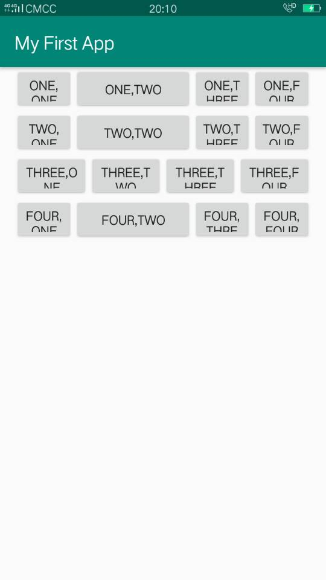
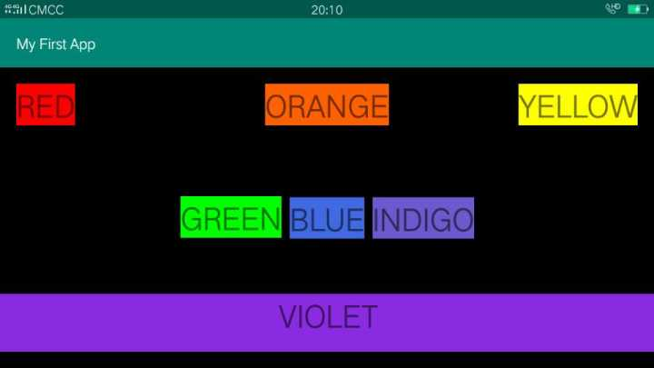
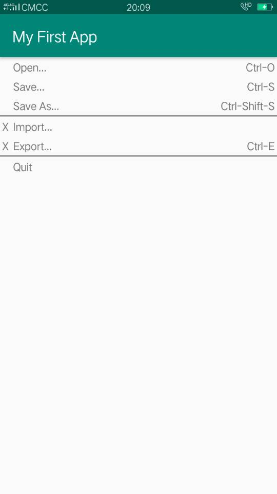

# Layout-helloworld
布局
## 实验一_验证Activity
1:定义两个可相互跳转的Activity类  

2:Override父类中Activity生命周期相关的方法  

3:通过Log.d打印日志到控制台实时观察方法的调用情况  

  

## 二、简介与截图

### 1、布局实验之LinearLayout

### 2、ConstraintLayout

### 3、TableLayout

